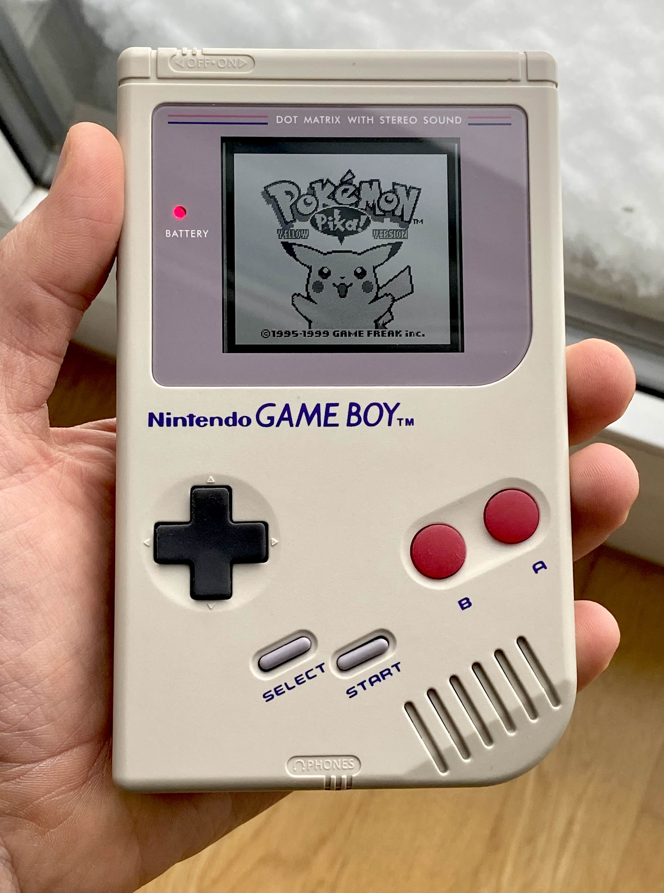
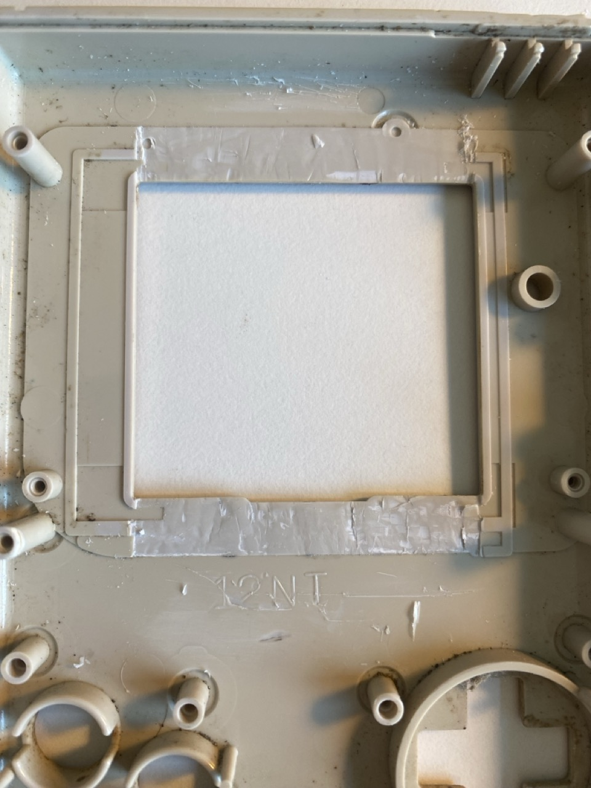
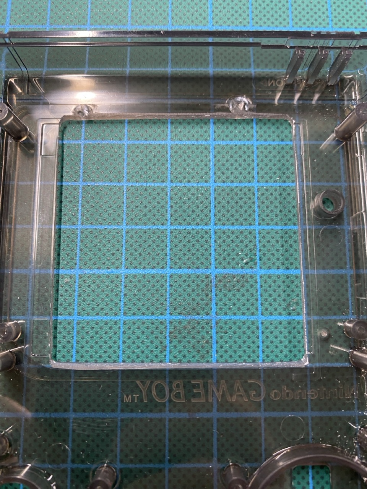
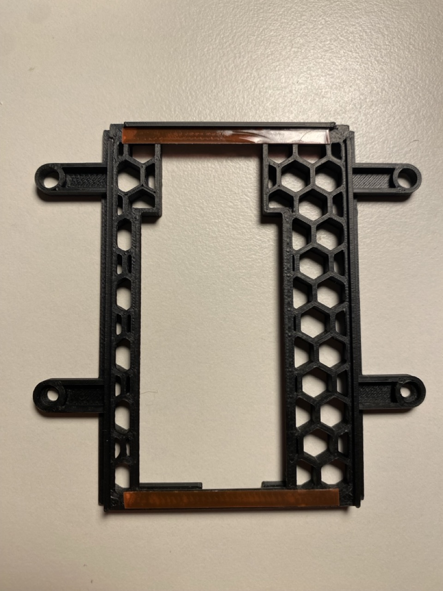
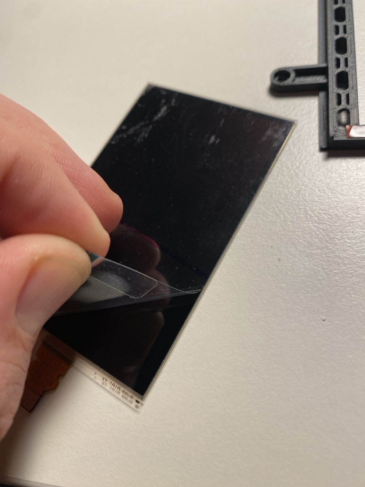
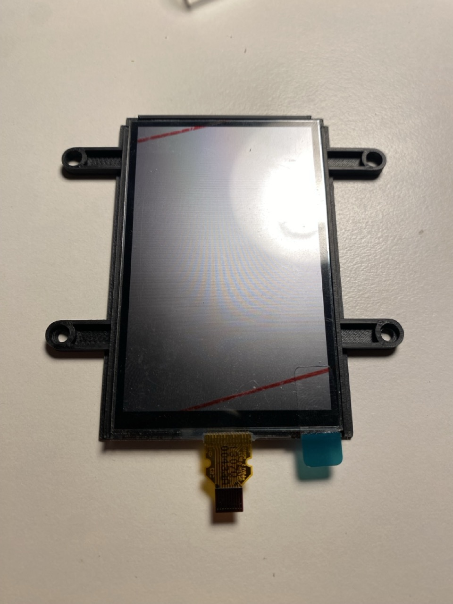
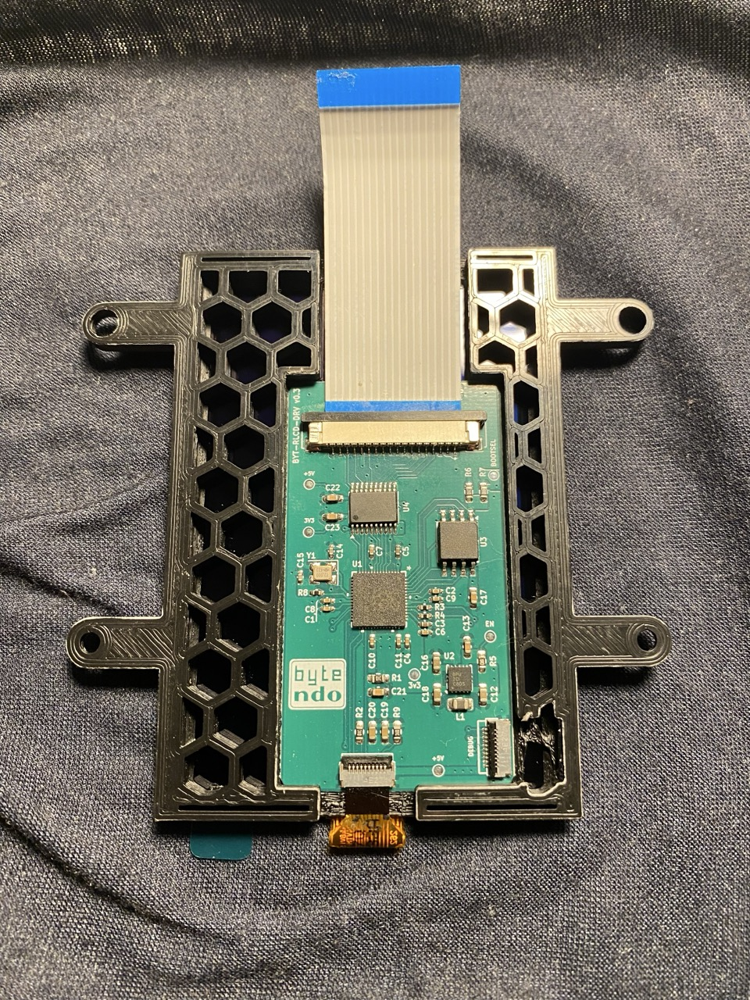

# RLCD-DMG

Ordering and build information for they Bytendo RLCD (Reflective Liquid Crystal Display) DMG display replacement kit. The driver kit is only sold at the [Bytendo Ko-Fi](https://ko-fi.com/bytendo). Please read this README before purchasing.

## What is it?

The Bytendo RLCD DMG kit is an LCD replacement mod, designed to evoke the original Gameboy experience, but with a much faster pixel response. The RLCD is a 1-bit monochrome display from Sharp, which is similar to the one used in the Playdate console. The Gameboy LCD signal is captured using an RP2040, then integer scaled 2x and dithered to simulate the Gameboy's 2-bit greyscale. All this happens fast enough to ensure a 60Hz refresh rate with about 2 frames of lag, similar to IPS kits on the market.

<p\>

## The Kit

* Driver PCB
* Mounting bracket
* 18p 1mm FPC (FP button board to driver)
* BYT-DEBUG board for flashing the driver
* 10p 0.5mm FPC for debug board

> [!IMPORTANT]
> * **The RLCD panel is not included in the kit**; I am not able to resell the panels
> * **The display is monochrome.** It's normally "white" with black pixels. Greyscale is simulated with dithering
> * The display area is **smaller than the OEM** display
> * **There is no backlight**. It's a purely reflective LCD, old school style
> * You must use an **aftermarket power board**, like the [DMGC PWR](https://github.com/MouseBiteLabs/Game-Boy-DMG-Color/tree/main/DMGC-PWR-01) 
> * The install requires **shell modification**, similar to Q5 installs. Details below

The RLCDs are currently available on [Aliexpress](https://www.aliexpress.com/item/1005006990424168.html?spm=a2g0o.productlist.main.5.4d197730mSHqFq&algo_pvid=dea5008d-0f81-494d-aab5-6f4624ba662d&algo_exp_id=dea5008d-0f81-494d-aab5-6f4624ba662d-2&pdp_npi=4%40dis%21USD%2132.92%2132.92%21%21%2132.92%2132.92%21%40211b813f17299659042513636eacc5%2112000038968470241%21sea%21CH%212760562420%21X&curPageLogUid=bwWWYRypVC4U&utparam-url=scene%3Asearch%7Cquery_from%3A) and I've also seen them on Ebay. They are extremely thin and liable to break if handled improperly. Please read the entire README to minimize risk.

> [!CAUTION]
> One beta tester found that the panel they recieved didn't work with the stock firmware. With some experimenting, we found this particular panel only worked with a lower SPI clock speed. It's unclear how common this is, but so far it is workable.

## Parts List

Here is a high level list of all the things you need to build an RLCD DMG. More details below.

1. Donor console, or a SGB
2. Trimmed shell, similar to a Q5 trim, OEM or aftermarket
3. Buttons, membranes, etc
4. Aftermarket button board, either [Funnyplaying](https://funnyplaying.com/products/dmg-retro-pixel-ips-lcd-kit) or [Highspeedido](https://www.aliexpress.com/item/1005006284948138.html?pdp_npi=4%40dis%21CHF%21CHF%2016.39%21CHF%2016.39%21%21%2117.61%2117.61%21%40211b804117394087675825167ebe07%2112000036608005878%21sh%21CH%212760562420%21X&spm=a2g0o.store_pc_allItems_or_groupList.new_all_items_2007615996548.1005006284948138)
5. CPU->Button board ribbon: [21P 1.25mm pitch, ~105mm](https://www.aliexpress.com/item/1005006653120976.html?spm=a2g0o.order_list.order_list_main.42.398f1802V1T3rC)
6. Aftermarket power board. Needs a stable +5V, OEM power board does not work. I use the [DMGC-PWR](https://github.com/MouseBiteLabs/Game-Boy-DMG-Color/tree/main/DMGC-PWR-01) board by Bucket Mouse

## Testing the Kit

It's a good idea to test the RLCD panel before installing. All 6 panels I've tested work fine with the stock firmware, but one beta tester found the panel appeared not to work at first and required some firmware tweaks.

* Attach the driver PCB to the debug PCB with the 10p 0.5mm ribbon
* Attach the LCD to the driver PCB
* Attach the USB-C cable to a PC or low power USB-C brick (not PD)

You should see some noise on the panel for a brief moment and then only a white square. If you see just noise and no square, then the panel is getting 5v but the init commands aren't making it to the panel. Double and triple check you have the ribbons connected. It's easy to bump the debug board and mess up the FPC alignment. I taped my debug board down to my desk when testing to prevent ripping the RLCD ribbon.

If everything is connected correctly and it's still not working, then the issue is likely the panel SPI clock for some reason can't keep up and we need to slow down the baud rate. It's a bit like a silicon lottery, sometimes you get a slower panel. I've prepared a few different firmwares with progressively slower baud rates, so just flash the next lower one until you see the panel respond correctly.

Note: There is no way you would notice the difference between a "fast" and "slow" panel. The difference in lag is maybe 3 or 4 milliseconds. So don't panic, your's isn't worse.

## DMG Installation

The install process is similar to other display replacement kits. 

### Shell Trimming

You need to modify the front shell to make space for the panel, following the trimming in the images. There are two posts that need to be removed, and some ridges that might damage the RLCD if the shell is flexed. Below is an example trim of an OEM shell, done using a razor.

<p\>

Another way to do it is to use a file and simple exand the viewing area as shown. You still need to remove the posts.

<p\>

The prototype shell was milled by a fellow modder, Oldirdey, who offers his custom milling services on the [Gameboy Discord](https://discord.com/invite/gameboy). His work is extremely clean and professional, and any scratches you see in my build are because I did them. The extra space made by the milling is really nice, and I think makes it look super clean. If you are doing an opaque shell though you can get away with hacking at it with a razor and nobody will know your crimes.

### Mounting the RLCD

The RLCD is extremely delicate, and the ribbon is easy to rip off. All of the panels I've recieved had a plastic film on both the front and the back. Leave the front film on until the very last step!

* Clean your workspace so it is free from debris, or anything that might put pressure on the RLCD
* Place a soft lint free cloth down on your work space
* Place thin double sided tap at the of and bottom of the bracket. There should be just enough width for 2-3 mm wide tape.

<p\>

* Remove only the back plastic film on the RLCD. Leave the front one on.

<p\>

* Align the top of the panel to the top bracket ridge. Gently lay down the panel so the top and bottom adhere well.
* If you attempt to remove the panel once the tape is in place, it's likely to crack the panel. I've removed a panel with a hairdryer and lots of patience.

<p\>

* Flip the bracket so that is RLCD down on the soft cloth. Be sure not to put pressure on the panel.
* Attach the IPS ribbon to the driver board first.
* The PCB slides into the bracket from the "top" to the "bottom". Once inserted, you can optionally secure it with a little bit of kapton tape. It may rattle around a little if you don't.
* Bend the RLCD ribbon just enough to slide into the FPC on the driver board and secure the FPC lock.
* Leave the plastic protection film on the front of the RLCD.

<p\>

## Testing the DMG connection

With the RLCD panel and driver PCB mounted, it's time to test the connections.

TODO: Image of the test setup

The RLCD will show a bit of noise (random pixels) when it boots, then it will quickly clear and show a black frame. This means the driver board has booted and is running properly. If you don't quickly see the normal "Nintento" logo, that means the driver board isn't getting a clean GB LCD signal. Usually this is an issue with the 21 pin ribbon from the CPU to the button board. I've found they fail over time with repeated insertions, so be careful. Try reseating this ribbon cable first.

If you see nothing on the RLCD, no noise or anything, then either the board hasn't booted or the RLCD isn't connected properly. Check both the RLCD ribbon and the input to the driver board from the GB.

### Flashing Firmware

The driver board comes with the firmware installed and all functions are tested. You use debug board to flash future firmware updates, or write fully custom firmware. It's basically a pico, afterall :) The debugger gerbers are [here](debug/BYT_DBG_v0.2.zip).

Here are the steps to flash the firmware using USB.

1. Attach the 10p ribbon to the driver board with the contacts facing the PCB (bottom contacts)
2. Attach the USB-C cable to the debugger cable, don't plug it into your PC yet
3. Insert the 10p ribbon into the debugger board, contacts facing the PCB (bottom contacts). Make sure the ribbon is lined up properly, it can be easy to have it unseat
4. While holding down the BOOTSEL button on the debugger, plug the USB-C cable into your PC

If all goes well, you should see the driver board show up as a mass storage device on your PC. Drag and drop the compiled UF2 file; it will eject itself when finished. After it is ejected you can disconnect all the cables.

## How do I get it?

At the moment I'll be making them to order, so you will have to register interest. To me this is more of an art project than a thing I'm selling. Visit [Bytendo Ko-Fi](https://ko-fi.com/bytendo). 

# Attribution

* [MGB/DMG Schematics](https://github.com/Gekkio/gb-schematics/blob/main/MGB-xCPU/schematic/MGB-xCPU.pdf), by [Gekkio](https://github.com/Gekkio)
  * Used to understand the LCD pinout 
* [DMG Scans](https://bitbuilt.net/forums/index.php?threads/dmg-gameboy-scan.4479/) by [Wesk](https://bitbuilt.net/forums/index.php?members/wesk.1486/)
  * Used to build the RLCD bracket and virtually test fit things
* ["I connected Gameboy LCD to ESP32 and Raspberry Pi. And then ..."](https://www.youtube.com/watch?v=gNlBDF8KRfo&t=411s) YouTube video by kgsws
  * Used to understand the LCD signal and it's nuances
* [jamo_mods](https://ko-fi.com/jamo_mods)
  * For the MGB Breakout Board. First PCB manufactured to connect the MGB to the pico
  * For the software help and debugging frenzy
* [MGGC](https://discord.com/invite/modded-gameboy-club-923851711498551327)
  * For the encouragement, love, and support 

## FAQ

### What about lag?

The lag is somewhere around 2 frames.

The source data from the gameboy is ~60Hz, which means each frame lasts 16.67 milliseconds. The driver captures a whole frame, then the source data is scaled and dithered to a 2x framebuffer in about 4 milliseconds. The data is then sent out to the RLCD in about 10 milliseconds, which means the end to processing takes about 14 milliseconds. Given pixel response times are not instant, it's fair to say that the percieved lag is around 2 frames. 

I've done side by side comparisons, where the data is split and sent to an OEM display and the RLCD kit at the same time. The OEM pixel response time is so slow, any lag introduced by the capture process is basically not noticable.

### What about battery life?

I tested using an an EZ-Flash JR running the iG battery test ROM.

* LADDA 1900 AAs: ~25 hrs
* LADDA 2650 AAs: ~30 hrs

### Is it e-ink?

No
